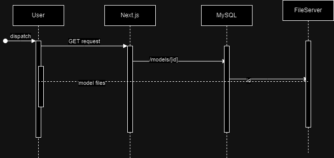

# VanVR app

## Introduction 
1.  Project Overview
   - The VanVR app is a website made for students to learn anatomy from high quality 3D models with annonatations to supplement a traditional anatomy lab.
    Technical features
   - Made primarily with Next.js,
   - styled with tailwind.css
   - a custom auth library with email verification, password recovery with a MySQL database and Auth.js
2. Target Platform
    - Web (Highest quality of model)
    - AR on Mobile
    - VR (Lowest quality of model)
3. Tools
    - Nextjs v14
    - Authjs v5 (formerly NextAuth)
    - Tailwind
    - Prisma ORM
    - MySQL 
    - Typescript

## Development Environment Setup
   1. Prerequisites
        - Nodejs
        - git
   2. Installation instructions
        - clone github repo
        - run npm install
        - run npm run dev | run npm run build
   3. Dependencies
        - N/A

## INDEX OF CONTENTS
# Codebase Structure 

- ### /actions
  - Backend server actions usually for filling form data or for tightly coupled together functions with the frontend

- ## /App 
  File structure within the app directory shows up as routing in the website. 
  
  For example: Content at /app/heart/page.tsx shows up at /heart when deployed. 
  want to know more about the app router [click here](https://nextjs.org/docs/app) 

    - ### /(protected)/  
        Includes all client side protected routes. Need to be signed in to access
        
        - /models/[id]
            Generic route for a model retrived from database 
            Uses id to retrieve model files
        - /admin
            Only admin access allowed for any route in here
            - addModel
                - Handles logic for uploading new models. Accepts a .obj, .mtl and a .txt file
        - /settings
            Landing page after auth where all the models user can access are displayed   
    
    - ### /api/ 
        - Backend routes that couldnt be converted into server actions
          - /auth/[...nextauth] 
               Handles Authjs events
          - / models
               Handles GET and POST requests to /api/models
            - [id]
              - Handles GET, PUT and DELETE requests to individuals within the Models collection
    - ### /auth/
        - Handles custom auth login
          - signin
          - register
          - verify email
          - password reset
    - ### /components/
        - Custom component library
          - /three
            Custom components abstracting away three.js use
          -/auth
            Custom components used throughout auth routes
           - /ui
            Custom buttons and form components to use with react-hook-form   
    - ### /data 
        Utils to abstract prisma use 
    
    - ### /lib
        Misc utils
        - db.ts - create prisma object [Singleton]
        - mail.ts - create mail utils with Resend API
        - token.ts - generate and grab tokens using email and the token header
    - ### /models
      - All models are stored here in development
      - TO be moved to a file server in production
    - ### /prisma
        - Define prisma schema
    - ### /schema
        - Define custom typescript types 
    - ### middleware.ts
        - Defining middlewares to be run between frontend and backend and implementing route protection. See routes.ts
    - ### routes.ts
        - Defining public, auth and adminonly routes. Be cautious editing this file. 

# Important files

- /lib/db.ts - Contains prisma instance of db. Used to manage all calls to the db

- /prisma/schema.prisma - Contains prisma Schema of the mySQL database
- schema/index.js - Contains all form schemas and zod validation logic
- auth.ts - auth config
- auth.config.ts - Prisma can't handle edge services so all edge functionality is handled here
- middleware.ts - Handles basic authentication and mass handles routes
- routes.ts - Defines public, private and auth routes. DO NOT CHANGE WITHOUT PERMISSION.
- /app/models/[id]  - Handles the display of models

# Architecture

## Schemas

- MySQL Schema

Note: 
    - Account is for OAuth authentication (not yet implemented)

## Key Design Patterns

- The Auth object is a singleton

# Asset Management

## Load model

- Model gets saved in the public directory and then gets displayed 
- To avoid a big client bundle, only one model is loaded at a time ( can be changed later )
- Each model has a unique url that can be shared and bookmarked